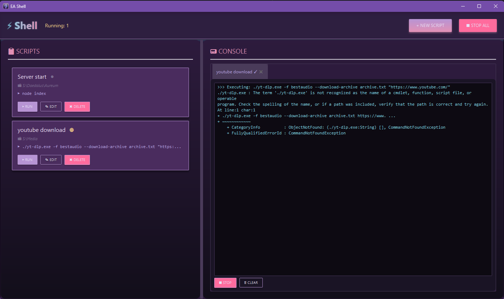

# EAShell


<div align="center">

**A modern JavaFX application for managing and executing CLI commands from a single interface**

[](https://www.oracle.com/java/)
[](https://openjfx.io/)
[](https://maven.apache.org/)
[](LICENSE)

</div>

---

## 📋 Overview

EAShell is a lightweight desktop application designed to simplify working with command-line scripts and programs. Instead of juggling multiple terminal windows, you can organize, manage, and execute all your CLI commands from one elegant interface.

### ✨ Key Features

- **🚀 Quick Script Execution** - Run multiple commands with a single click
- **📁 Working Directory Support** - Execute scripts in specific folders
- **📟 Real-time Console Output** - Monitor execution in separate tabs
- **💾 Persistent Storage** - Scripts are saved in `eashell_data.json` for easy backup and transfer
- **🎨 Modern UI** - Clean, dark-themed interface built with JavaFX
- **⚡ Multi-threaded** - Run multiple scripts simultaneously without blocking
- **🖥️ Cross-platform** - Works on Windows, Linux, and macOS

---

## 🖼️ Screenshots



```
┌──────────────────────────────────────────────────────────┐
│ ⚡ Shell  Running: 2      [+ NEW] [⏹ STOP ALL]          │
├────────────────────┬─────────────────────────────────────┤
│ Script List        │ 📟 CONSOLE                          │
│ ┌────────────────┐ │ ┌─────────────────────────────────┐ │
│ │ [ScriptCard 1] │ │ │ [Tab1] [Tab2]                   │ │
│ │ [ScriptCard 2] │ │ │ >>> Executing: npm start        │ │
│ │ [ScriptCard 3] │ │ │ Server running on port 3000...  │ │
│ │ ...            │ │ │                                 │ │
│ └────────────────┘ │ │ [⏹ STOP] [🗑 CLEAR]             │ │
│                    │ └─────────────────────────────────┘ │
└────────────────────┴─────────────────────────────────────┘
```

---

## 🚀 Getting Started

### Prerequisites

- **Java 17 or higher** installed on your system
- **Maven 3.8+** (for building from source)

### Installation

#### Option 1: Download Pre-built Executable (Windows)

1. Download `EAShell.exe` from the releases section
2. Extract the archive
3. Run `EAShell.exe`

#### Option 2: Build from Source

```bash
# Clone the repository
git clone https://github.com/yourusername/eashell.git
cd eashell

# Build with Maven
mvn clean package

# Run the application
java -jar target/EAShell-1.1.1.jar
```

#### Option 3: Run with Maven

```bash
mvn clean javafx:run
```

---

## 📖 Usage

### Creating a Script

1. Click the **[+ NEW]** button in the top bar
2. Fill in the script details:
    - **Name**: A descriptive name for your script
    - **Commands**: One or more CLI commands to execute (one per line)
    - **Working Directory**: The folder where commands should run
3. Click **Save**

### Running a Script

1. Find your script in the left panel
2. Click the **[▶ RUN]** button
3. Monitor output in the console tab that opens on the right

### Managing Scripts

- **Edit**: Click the **[✎ EDIT]** button to modify a script
- **Delete**: Click the **[✗ DELETE]** button to remove a script
- **Stop**: Use **[⏹ STOP]** in the console tab or **[⏹ STOP ALL]** to terminate running scripts

### Transferring Scripts

All scripts are stored in `eashell_data.json` in the application directory. To transfer your scripts:

1. Locate the `eashell_data.json` file
2. Copy it to your new installation
3. Replace the existing file (or merge manually if needed)

---

## 🏗️ Project Structure

```
eashell/
├── src/main/java/com/eashell/
│   ├── App.java                    # Application entry point
│   ├── model/
│   │   ├── ScriptEntry.java        # Script data model
│   │   └── ScriptRepository.java   # JSON persistence layer
│   ├── service/
│   │   └── ProcessRunner.java      # Script execution engine
│   ├── ui/
│   │   ├── MainWindow.java         # Main application window
│   │   ├── components/
│   │   │   ├── OutputPanel.java    # Console output panel
│   │   │   ├── ScriptListPanel.java # Script list panel
│   │   │   └── TopBar.java         # Top navigation bar
│   │   └── dialogs/
│   │       ├── ScriptDialog.java   # Add/Edit script dialog
│   │       └── DeleteConfirmDialog.java
│   └── util/
│       ├── Constants.java          # Application constants
│       └── StyleManager.java       # UI styling
├── pom.xml                         # Maven configuration
└── eashell_data.json              # Script storage (auto-generated)
```

---

## 🔧 Configuration

### System-Specific Execution

- **Windows**: Commands are executed via PowerShell with `-NoProfile` and `-ExecutionPolicy Bypass`
- **Linux/macOS**: Commands are executed via `sh -c`

### Performance Settings

The application includes optimized settings for output handling:
- UI update interval: 100ms
- Buffer flush threshold: 8KB
- Maximum output buffer: 500KB per script

---

## 🛣️ Roadmap

Planned features for future releases:

- [ ] **Enhanced UI/UX** - More polished interface with better visual feedback
- [ ] **Script Timers** - Schedule scripts to run at specific times
- [ ] **Performance Optimizations** - Improved memory usage and responsiveness
- [ ] **Script Templates** - Pre-configured templates for common tasks
- [ ] **Search & Filter** - Quickly find scripts in large collections
- [ ] **Export/Import** - Advanced script sharing capabilities
- [ ] **Environment Variables** - Support for custom environment variables per script
- [ ] **Command History** - Track execution history and outcomes

---

## 🤝 Contributing

Contributions are welcome! Here's how you can help:

1. Fork the repository
2. Create a feature branch (`git checkout -b feature/amazing-feature`)
3. Commit your changes (`git commit -m 'Add amazing feature'`)
4. Push to the branch (`git push origin feature/amazing-feature`)
5. Open a Pull Request

---

## 📝 Technical Details

### Dependencies

- **JavaFX 17.0.2** - UI framework
- **Gson 2.10.1** - JSON serialization
- **JUnit 5** - Testing framework

### Build Tools

- **Maven** - Dependency management and build automation
- **Launch4j** - Windows executable generation

---

## 🐛 Troubleshooting

### Application won't start
- Ensure Java 17+ is installed: `java -version`
- Check that `JAVA_HOME` environment variable is set correctly

### Scripts fail to execute
- Verify the working directory exists and is accessible
- Ensure PowerShell (Windows) or sh (Linux/macOS) is available
- Check command syntax is correct for your operating system

### JSON file corruption
- Backup your `eashell_data.json` regularly
- If corrupted, delete the file and restart the application (scripts will be lost)

---

## 📄 License

This project is licensed under the GNU GENERAL PUBLIC LICENSE - see the [LICENSE](LICENSE) file for details.

---

## 👨‍💻 Author

Created with ❤️ by the StarLith

---


---

<div align="center">

[Report Bug](https://github.com/yourusername/eashell/issues) · [Request Feature](https://github.com/yourusername/eashell/issues) · [Documentation](https://github.com/yourusername/eashell/wiki)

</div>