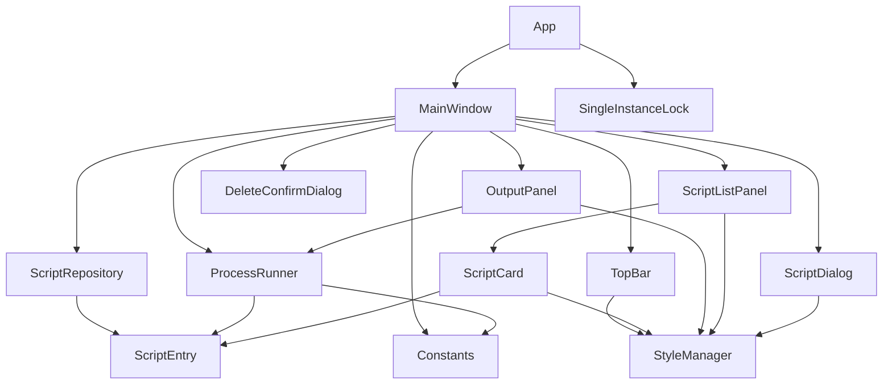
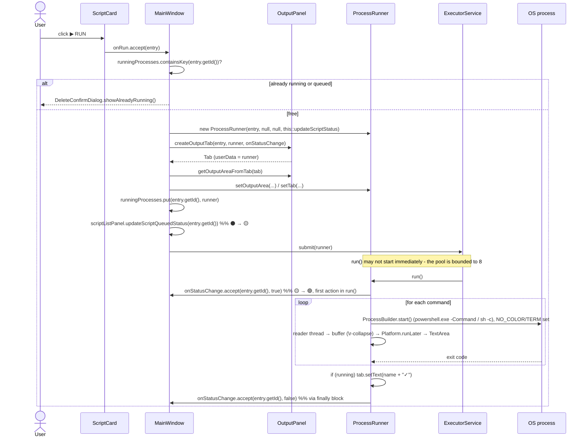
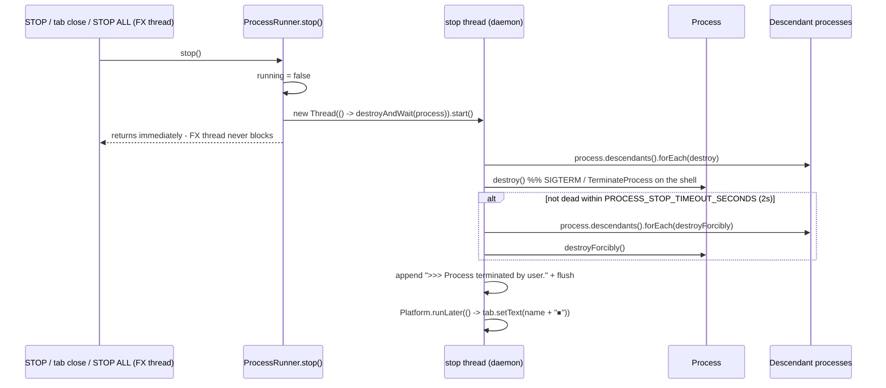

# EAShell — Architecture

> Version described: **2.0.1** · Java 17 · JavaFX 17.0.2 · Maven
>
> Companion documents: [`IMPROVEMENTS.md`](IMPROVEMENTS.md) (defects and technical debt) ·
> [`ROADMAP.md`](ROADMAP.md) (feature designs and what is out of scope) ·
> [`PACKAGING.md`](PACKAGING.md) (shipping without a Java requirement) ·
> [`../CLAUDE.md`](../CLAUDE.md) (contributor quick reference).

---

## 1. What the application is

EAShell is a single-window JavaFX desktop launcher for shell commands. A user stores named
*scripts* (a working directory + an ordered list of shell commands, optionally assigned to a
group), runs them with one click, answers prompts via stdin, and watches their combined
stdout/stderr in per-script console tabs. Scripts are persisted to a JSON file under the user's
profile.

There is no server, no database, no network layer, and no framework beyond JavaFX + Gson. The whole
application is ~1700 lines of Java across 15 classes.

**Design axes that shaped the code:**

| Axis | Decision |
| --- | --- |
| Persistence | Single flat JSON file under `%USERPROFILE%\.eashell\`, rewritten atomically on every mutation |
| Identity | `ScriptEntry.id` (a UUID) — see §6 |
| Concurrency | One `ProcessRunner` per running script on a bounded thread pool (8) |
| UI construction | 100% programmatic (no FXML), styles in a real CSS resource file |
| Distribution | Launch4j `.exe` (needs a system JRE) **or** a self-contained jpackage app-image (does not) |
| State | Held in memory by `MainWindow`; no observable-property bindings |

---

## 2. Build and packaging

```
mvn clean package                →  target/EAShell-2.0.1.jar        (manifest Class-Path: libs/*)
                                     target/libs/*.jar               (deps + the app jar itself, staged by antrun)
                                     target/EAShell.exe              (Launch4j GUI wrapper, needs a system JRE 17+)
mvn clean javafx:run             →  run from sources via javafx-maven-plugin
powershell -File scripts/package.ps1  →  target/dist/EAShell/EAShell.exe (self-contained app-image, no JRE needed)
```

Key `pom.xml` facts:

- `maven.compiler.release = 17`; `javafx.version = 17.0.2`.
- **Not** modular — there is no `module-info.java`. JavaFX is put on the classpath, and Launch4j
  additionally passes `--module-path libs --add-modules javafx.controls,javafx.fxml,javafx.graphics`
  to the JRE. The app therefore relies on the *unnamed module* path working, which is why
  `javafx-graphics`/`javafx-base` are declared explicitly rather than pulled transitively only.
- The JAR manifest, Launch4j, and jpackage all point at **`com.eashell.Launcher`**, not `App`, as the
  main class. `Launcher` is a plain `main()` that just calls `App.main(args)` — a class extending
  `Application` run off the classpath (rather than the module path) makes the JVM refuse to start
  with "JavaFX runtime components are missing". `App` itself is unchanged and still the real entry
  point for `mvn javafx:run`.
- `maven-antrun-plugin` copies the built app JAR into `target/libs` at the `package` phase, so
  jpackage's `--input` can point at one directory containing everything (`docs/PACKAGING.md` §2).
  `copy-dependencies` is scoped to `<includeScope>runtime</includeScope>` (v2.0.1, item 29) - without
  it, the JUnit test stack was shipping inside the app-image too.
- The Launch4j `versionInfo` block hardcodes `2.0.1.0` — the version lives in **three** places
  (`<version>`, `fileVersion`/`productVersion`, and the README run command). Unfixed —
  [`IMPROVEMENTS.md`](IMPROVEMENTS.md) item 17.
- `dependency-reduced-pom.xml` in the repo root is a leftover from a `maven-shade-plugin` setup that
  no longer exists in `pom.xml`. It is stale and unused.
- `.mvn/jvm.config` and `.mvn/maven.config` exist but are empty.

Entry points: `com.eashell.App` (declared in the javafx-maven-plugin config, for `mvn javafx:run`) and
`com.eashell.Launcher` (declared in the JAR manifest, Launch4j, and jpackage).

---

## 3. Package map

```
com.eashell
├── App.java .......................... JavaFX Application; checks SingleInstanceLock, loads
│                                        /app.png icon, hands off to MainWindow
├── Launcher.java ..................... Packaging-only entry point; does NOT extend Application
├── model/
│   ├── ScriptEntry.java .............. Data record: id (UUID), name, group (nullable), workingDir,
│   │                                   List<String> commands. equals/hashCode are ID-ONLY.
│   └── ScriptRepository.java ......... In-memory List + Gson read/write of eashell_data.json,
│                                       atomic save, corrupt-file recovery, legacy-path migration
├── service/
│   └── ProcessRunner.java ............ Runnable. Executes a ScriptEntry's commands sequentially,
│                                       pumps process output into a TextArea through a throttled
│                                       buffer, exposes sendInput() for stdin, fires onStatusChange
├── ui/
│   ├── MainWindow.java ............... Composition root + all user-action handlers + process registry
│   ├── components/
│   │   ├── TopBar.java ............... Title, "Running: N" poller, [+ NEW SCRIPT], [⏹ STOP ALL]
│   │   ├── ScriptListPanel.java ...... Left 40%: one TitledPane per group → ScriptCards, id→card index
│   │   ├── ScriptCard.java ........... One script: title+status dot, path, commands, RUN/EDIT/DELETE
│   │   └── OutputPanel.java .......... Right 60%: TabPane, one console tab per run + stdin field
│   └── dialogs/
│       ├── ScriptDialog.java ......... Static add/edit form (name, path + Browse, group combo,
│       │                              commands textarea); validates and disables OK until valid
│       └── DeleteConfirmDialog.java .. Static confirm alert + "already running" warning
└── util/
    ├── Constants.java ................ File paths, buffer/timeout numbers, window size, UI strings, emoji
    ├── StyleManager.java ............. Style-class-name constants (by role, not hue) + button/label
    │                                  factories — colors and CSS rules live in app.css, not here
    ├── SingleInstanceLock.java ....... FileChannel.tryLock() on a lock file under the data dir
    ├── UI.md .......................... (UA) Visual map of the widget tree — design reference
    └── style_guide/ ................... (UA) Palette / styling notes — pre-CSS-migration, historical
```

`src/main/resources/` holds `app.ico` (Launch4j), `app.png` (window icon), `demo.png` (README), and
`styles/app.css` (the application stylesheet — see §7).

---

## 4. Dependency direction



Two properties are worth calling out because they constrain every future change:

1. **`MainWindow` is the only mediator.** Child components never talk to each other or to the
   repository; they receive `Consumer`/`Runnable`/`Supplier` callbacks in their constructors. This
   keeps components testable in principle, but concentrates all coordination logic in one class.
2. **`ProcessRunner` reaches *into* the UI.** It holds a `TextArea` and a `Tab` and calls
   `Platform.runLater` itself. The service layer is therefore not headless and cannot be
   unit-tested without a JavaFX toolkit. This is still the single largest structural coupling in the
   codebase — unchanged by adding the `onStatusChange` callback and `sendInput()`, both of which live
   alongside the same coupling rather than removing it. See [`IMPROVEMENTS.md`](IMPROVEMENTS.md) item 14.

---

## 5. Runtime & threading model

Three kinds of threads are live at any moment:

| Thread | Created by | Purpose |
| --- | --- | --- |
| JavaFX Application Thread | JavaFX | All widget mutation. Every cross-thread update funnels through `Platform.runLater`. |
| Runner threads | `Executors.newFixedThreadPool(8)` in `MainWindow` (daemon) | One per running script; executes `ProcessRunner.run()` — the sequential command loop, blocking on `process.waitFor()`. Bounded so running a whole group can't spawn unlimited threads/processes/tabs at once; excess submissions just queue. |
| Reader threads | `new Thread(this::readProcessOutput)` in `ProcessRunner` (daemon) | One per *command*; drains the merged stdout+stderr stream. |
| Stop threads | `new Thread(() -> destroyAndWait(...))` in `ProcessRunner.stop()` (daemon) | One per `stop()` call; every caller (STOP button, tab close, STOP ALL, window close) is on the FX thread, and destroying a stubborn process can block up to `PROCESS_STOP_TIMEOUT_SECONDS` - this thread exists so `stop()` itself returns immediately instead of freezing the UI. |
| Status poller | `java.util.Timer` in `TopBar` (daemon) | Fires every 1000 ms, reads `runningProcesses.size()`, posts a label update. Still polling — [`IMPROVEMENTS.md`](IMPROVEMENTS.md) item 19 is unfixed. Also still counts scripts merely *queued* behind the bounded pool, not just actively executing ones — item 26. |

Shared state:

- `MainWindow.runningProcesses : ConcurrentHashMap<String, ProcessRunner>` — keyed by **script id**
  (`ScriptEntry.getId()`), not name. This map is the source of truth for "is this script running" and
  for the TopBar counter.
- `ProcessRunner.running : volatile boolean` — cooperative cancellation flag read by both the runner
  loop and the reader loop.
- `ProcessRunner.outputBuffer : StringBuilder` guarded by `synchronized (outputBuffer)`. Also tracks
  `pendingLineLength`/`currentLineStartInBuffer`/`discardPendingAreaLine` to collapse `\r`-driven
  progress-bar output into a single updating line (§8).

### Output back-pressure

Raw process output is never pushed straight to the UI. `readProcessOutput` reads into an 8 KB
`char[]` (`Constants.READER_BUFFER_SIZE`) and appends to `outputBuffer`. A flush to the UI happens
when **either** ≥100 ms elapsed since the last flush (`UI_UPDATE_INTERVAL_MS`) **or** the buffer
exceeds 4 KB (`FLUSH_THRESHOLD`). On flush, the accumulated text is appended to the `TextArea` on the
FX thread and the area is truncated to the last 10 000 characters (`MAX_BUFFER_SIZE`), then scrolled
to the bottom. `Constants.java` is authoritative for these numbers; the README now matches it.

### Sequence — running a script



Unlike the pre-2.0 version, the finally block always calls `onStatusChange`, on every exit path
(success, error, or `stop()`) — see [`IMPROVEMENTS.md`](IMPROVEMENTS.md) item 1 for what this
replaced. The queued→running split (item 26) and the `if (running)` guard on the success title
(item 27) were both added in v2.0.1, fixing regressions the bounded pool and `stop()` introduced.

### Sequence — stopping



`stop()` walks `process.descendants()` before killing the parent, both on the graceful path and the
forcible-kill fallback, so children (`node`, `yt-dlp.exe`, dev servers, …) no longer survive STOP —
see [`IMPROVEMENTS.md`](IMPROVEMENTS.md) item 2. The destroy-and-wait sequence itself moved onto a
dedicated daemon thread in v2.0.1 (item 24): every caller of `stop()` is on the FX thread, and
waiting up to `PROCESS_STOP_TIMEOUT_SECONDS` per script - times up to 8 concurrent scripts on STOP
ALL - was freezing the window for several seconds.

---

## 6. Data model & persistence

`eashell_data.json` — a JSON array, pretty-printed by Gson, written to **`%USERPROFILE%\.eashell\`**
(`Constants.DATA_FILE`), independent of the launch directory. An existing CWD-relative file
(`Constants.LEGACY_DATA_FILE`) is *copied* (not moved) to the new location on first run.

```json
[
  {
    "id": "6f1e2b2a-...-uuid",
    "name": "Kiroku-rule34",
    "group": null,
    "workingDir": "S:\\Daedalus\\Kiroku\\kiroku-dl-rule34",
    "commands": ["node index.js"]
  }
]
```

Repository semantics (`ScriptRepository.java`):

- Loaded once in the constructor; the in-memory `List` is the working copy. The constructor also
  accepts an explicit `(dataFile, legacyDataFile)` pair (package-private) so tests can point it at a
  `@TempDir` instead of the real per-user location.
- `getAll()` returns a **defensive copy of the list** — but the `ScriptEntry` objects inside are
  shared and mutable.
- `add` / `update` / `remove` each call `save()`, which writes UTF-8 to a `.tmp` file and atomically
  renames it over the real one (`Files.move(..., REPLACE_EXISTING, ATOMIC_MOVE)`) — a crash or full
  disk mid-write can no longer leave a truncated, unparseable file behind.
- `update` locates the old entry via `List.indexOf` → uses `ScriptEntry.equals` → **matches by id**.
  Renaming, regrouping, or editing anything else about a script preserves its identity as long as the
  caller carries the id forward (see `CLAUDE.md` rule 2).
- `loadEntries` catches both `IOException` and `JsonSyntaxException`. On the latter, the corrupt file
  is renamed to `eashell_data.json.corrupt-<timestamp>`, the in-memory list resets to empty, and
  `wasDataFileCorrupt()`/`getCorruptDataFileBackupPath()` let `MainWindow` show an explanatory `Alert`
  — the window still appears, nothing is silently discarded.
- Entries loaded without an `id` (data saved before ids existed) are backfilled with a fresh UUID and
  immediately persisted, so identity doesn't drift across relaunches.

Because `id` — not `name` — is the identity used by `equals`, by `scriptCards`, and by
`runningProcesses`, **duplicate script names are fine**; groups make that a normal occurrence.

---

## 7. UI layer & styling system

Layout is a `BorderPane`: `TopBar` at the top, a `SplitPane` in the centre with the divider at 0.4.
Window default 1400×800. Full widget-tree drawings live in
[`../src/main/java/com/eashell/util/UI.md`](../src/main/java/com/eashell/util/UI.md) (Ukrainian, and
predates the CSS migration below — the widget tree is still accurate, the styling mechanics it
describes are not).

Styling is a real stylesheet: **`src/main/resources/styles/app.css`**, loaded once via
`scene.getStylesheets().add(getClass().getResource("/styles/app.css").toExternalForm())` in
`MainWindow.show()`. Colors are custom properties on `.root` (e.g. `-accent-danger`), referenced by
every rule that needs them — a color exists in exactly one place. Components apply a look with
`node.getStyleClass().add("some-class")`; hover and focus states are real `:hover`/`:focused` CSS
rules, which only override the specific properties they declare (unlike the old JS-based
`setOnMouseEntered`/`Exited` approach, which replaced the entire inline style string and could
silently wipe any other style set on the node).

**Dialogs own their own `Scene`** and do not inherit the main window's stylesheet automatically —
`ScriptDialog` attaches `app.css` to its `DialogPane` directly
(`dialogPane.getStylesheets().add(...)`), and separately styles its `header-panel` and the built-in
OK/Cancel buttons (scoped to `.app-dialog` specifically, so plain `Alert` dialogs like
`DeleteConfirmDialog` keep their untouched default look).

`StyleManager.java` now only holds style-class-name constants — named by role
(`BTN_PRIMARY`/`BTN_ACCENT`/`BTN_NEUTRAL`/`BTN_DANGER`), not by the hue they happened to render as —
plus the button and label factory methods (`createSmallButton`, `createStyledButton`, `createLabel`)
and the status-indicator helpers (`setRunningStatus`/`setStoppedStatus`).

Design intent and the *original* palette rationale are documented in
[`../src/main/java/com/eashell/util/style_guide/`](../src/main/java/com/eashell/util/style_guide/) —
useful for the "why this color" story, not for how styling is wired today.

---

## 8. Cross-platform command execution

`ProcessRunner.run()` branches on `os.name`:

| Platform | Invocation |
| --- | --- |
| Windows | `[Console]::OutputEncoding=[System.Text.Encoding]::UTF8; <cmd>` via `powershell.exe -NoProfile -ExecutionPolicy Bypass -Command` |
| Other | `sh -c <cmd>` |

`pb.redirectErrorStream(true)` merges stderr into stdout, so the console tab shows one interleaved
stream and error text is not visually distinguishable (deliberately deferred — see
[`ROADMAP.md`](ROADMAP.md) §5.4).

Implications to keep in mind:

- `-ExecutionPolicy Bypass` is intentional (the app exists to run arbitrary user commands) but means
  EAShell will happily execute anything in `eashell_data.json`. That file is user-owned and
  git-ignored; treat it as trusted input only.
- The process stream is decoded as **UTF-8** (`Constants.CONSOLE_CHARSET`), matching the
  `OutputEncoding` forced on the PowerShell side — Cyrillic/box-drawing output that used to mojibake
  now round-trips correctly.
- `pb.environment().put("NO_COLOR", "1")` / `"TERM", "dumb"` are set before every command, so
  well-behaved CLI tools don't emit ANSI escapes in the first place.
- **stdin now works.** `ProcessRunner` opens a `BufferedWriter` on the process's output stream per
  command and exposes `sendInput(line)`, wired to a `TextField` under each console's output area.
  Not every program reads stdin (full-screen TUIs, `pause`), and PowerShell's `-Command` invocation
  can swallow the pipe in some cases — see [`ROADMAP.md`](ROADMAP.md) §2 for the known limitations.
- The working directory is passed to `ProcessBuilder.directory(new File(...))` without an existence
  check; a missing directory surfaces as an `IOException` in the `catch` block as `>>> ERROR: ...`.
  (`ScriptDialog` does check `Files.isDirectory(...)` before letting you save a *new* entry, but an
  existing entry's directory could still disappear later.)

---

## 9. Known behavioural gaps

These are architectural facts, not style opinions — they change how the app behaves. Fixes and
priorities are in [`IMPROVEMENTS.md`](IMPROVEMENTS.md); this list only covers what's still open as of
v2.0.1 (the v2.0.0 verification pass found four real regressions here - `\r` handling, `stop()`
blocking the FX thread, the run registry's queued/running conflation, and a stopped run reporting
success - all fixed in v2.0.1; see `IMPROVEMENTS.md` items 23, 24, 26, 27).

1. **The `process` field is reassigned per command** while the previous reader thread may still hold
   a reference, joined with only a 1 s timeout. A slow-draining reader can observe the next command's
   process — item 10.
2. **`getOutputAreaFromTab` indexes children positionally** (`get(0)`), so any change to the tab's
   VBox child order (`[outputArea, stdin field, controlBox]`) silently breaks output routing — item 12.
3. **Cleanup only runs from the window's close button**, not from `Platform.exit()` or an OS-level
   shutdown — item 13.
4. **`ProcessRunner` is still coupled to JavaFX widgets** (`TextArea`, `Tab`, direct
   `Platform.runLater` calls), so the service layer isn't unit-testable without a JavaFX toolkit —
   item 14.
5. **`TopBar` polls once a second forever**, even fully idle — item 19.
6. **Script-group expand/collapse state isn't persisted.** `ScriptListPanel.refresh()` rebuilds every
   `TitledPane` expanded, so adding/editing/deleting any script re-expands every group. Deliberately
   deferred to [`ROADMAP.md`](ROADMAP.md) §6 (window-geometry persistence), not a defect in the
   groups feature itself.
7. **"Running: N" still counts queued scripts**, not just actively-executing ones. The queued/running
   *card* indicator was split in v2.0.1 (🟡 vs 🟢, item 26), but the counter still reads
   `runningProcesses.size()`, and a queued runner is already in that map. Known, not fixed.

---

## 10. Where to extend

Concrete designs for planned features — and the list of things deliberately not being built — are in
[`ROADMAP.md`](ROADMAP.md). The table below is the general map.

| You want to… | Touch |
| --- | --- |
| Add a field to a script (env vars, shell choice, autostart) | `ScriptEntry` → `ScriptDialog` form + `extractScriptEntry` → `ScriptCard` render → `ProcessRunner` use. JSON is additive-safe: unknown/missing fields deserialise to `null`, as `group` and (historically) `id` already demonstrate. |
| Change how commands run | `ProcessRunner.run()` only. Keep the `running` flag checks between commands. |
| Add a toolbar action | `TopBar` constructor takes callbacks; add a `Runnable` parameter and wire the handler in `MainWindow.show()`. |
| Add per-script UI (search, filter, reorder) | `ScriptListPanel.refresh()` is the single render path; it is called after every mutation, and now groups entries before rendering. |
| Change persistence (multiple profiles, SQLite) | `ScriptRepository` is fully encapsulated — `MainWindow` only calls `getAll/add/update/remove`. The `(dataFile, legacyDataFile)` constructor already demonstrates injecting a different location. |
| Restyle | `src/main/resources/styles/app.css` only. Add a custom property to `.root` for a new color, a class for a new look; only touch `StyleManager.java` if a *new* style-class-name constant is needed. |
| Make the service layer testable | Replace `TextArea`/`Tab` in `ProcessRunner` with a `Consumer<String>` sink and a status callback. This is the prerequisite for any meaningful `ProcessRunner` unit test — item 14. |

---

## 11. Testing status

`ScriptEntryTest` (7 tests) and `ScriptRepositoryTest` (6 tests) cover equality/id semantics, Gson
round-tripping (including the `group` field and missing-field defaults), and the repository's
round-trip/missing-file/corrupt-file/legacy-migration behavior, using the package-private
`(dataFile, legacyDataFile)` constructor with `@TempDir`. `AppTest` is still the original placeholder.
`ProcessRunner` remains untestable without a JavaFX toolkit, for the reason given in §4 — item 14 is
the prerequisite.

Last verified at v2.0.0: `mvn -B clean test` → BUILD SUCCESS, 14/14 tests; `mvn -B clean package` and
a full `jpackage` app-image build both succeed, and the app-image runs with no system Java present.
The cost of item 14 is visible here: the `\r` defect (item 23) sat in exactly the code that has no
test, and was only caught by replaying the algorithm outside the app - a `ProcessRunner` unit test
would have caught it before it shipped.

v2.0.1 fixed items 23-32 (all manually verified against the running app: clean `\r` progress output,
STOP ALL no longer freezing the window, group re-run not stacking dialogs, STOP not reporting
"success", empty-commands validation) and re-ran the full test suite and a clean package build with
no regressions.
